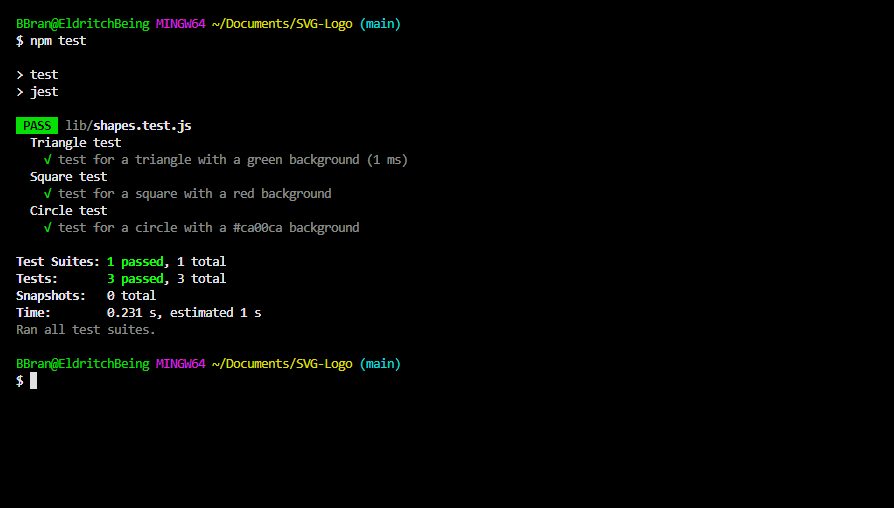

# SVG-Logo

## Description 🔎

A small logo generator powered by user input through the console that generates a
colored shape with any 3 character text after the user answers 4 small questions. Inquirer was used to generate the user prompt.

## User Story

```md
AS a freelance web developer
I WANT to generate a simple logo for my projects
SO THAT I don't have to pay a graphic designer
```

## Acceptance Criteria

```md
GIVEN a command-line application that accepts user input
WHEN I am prompted for text
THEN I can enter up to three characters
WHEN I am prompted for the text color
THEN I can enter a color keyword (OR a hexadecimal number)
WHEN I am prompted for a shape
THEN I am presented with a list of shapes to choose from: circle, triangle, and square
WHEN I am prompted for the shape's color
THEN I can enter a color keyword (OR a hexadecimal number)
WHEN I have entered input for all the prompts
THEN an SVG file is created named `logo.svg`
AND the output text "Generated logo.svg" is printed in the command line
WHEN I open the `logo.svg` file in a browser
THEN I am shown a 300x200 pixel image that matches the criteria I entered
```

## Table of Contents 📖

-Installation

-Usage

-License

-Test

-Credits

-Questions

-Deployed Application

## Installation ⚙️

The user can clone the repo from https://github.com/BBrantly90/SVG-Logo. Once cloned they can open it in Visual Studio Code. A short video showing a small walkthrough can be seen here: https://drive.google.com/file/d/1L1HZgsAA2mGRLU4Ta-UHyXRRVK5p-mH8/view.

## Usage 🎮

Small developers can generate their own simple logos without having to outsource and hire a graphic designer to do the job.

## License 📝

This application is covered by the MIT license.

## Tests 🧪



this is an image of a test that was run with the application.

## Credits 🧑‍🤝‍🧑

Author: Bryan Brantly
Node.js
Inquirer.js
Jest.js
Visual Studio Code

## What I learned

I learned how to work with node.js and inquirer when it came to collecting user input. I became more familiar with running tests using jest and the 'npm run test' command.

## Questions 🙋

If there are any questions, feel free to contact my email at: Bryan4690@gmail.com

You can also find me on GitHub at: BBrantly90

## Deployed Application 🚀

This application was deplopyed at: https://github.com/BBrantly90/SVG-Logo